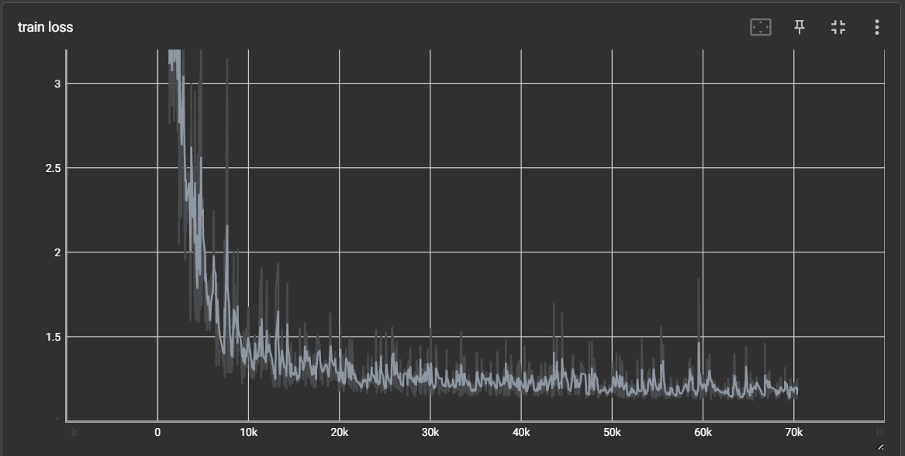
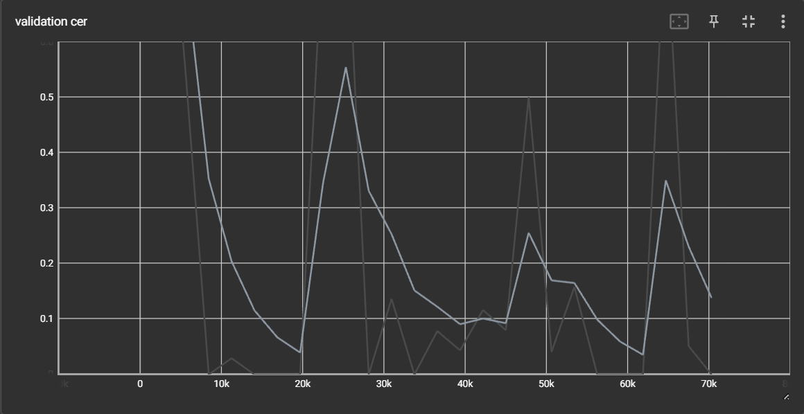

# Transformer from Scratch in PyTorch

This repository contains a PyTorch implementation of the Transformer model, as introduced in the paper "Attention Is All You Need". The project is designed to be a clear and educational resource for understanding and building the Transformer architecture from the ground up.

---

## Table of Contents

- [Project Overview](#project-overview)
- [Features](#features)
- [Results](#results)
- [File Structure](#file-structure)
- [Getting Started](#getting-started)
- [Usage](#usage)
- [ONNX Export and Benchmarking](#onnx-export-and-benchmarking)
- [Contributing](#contributing)

---

## Project Overview

This project provides a complete implementation of the Transformer model for machine translation. The code is structured to be modular and easy to follow, with separate components for the model architecture, data loading, training, and evaluation. The primary goal of this repository is to serve as a learning resource for those interested in deep learning and natural language processing.

---

## Features

- **Full Transformer Architecture:** Implementation of the encoder-decoder structure with multi-head self-attention and feed-forward networks.
- **Data Loading and Preprocessing:** Scripts for loading and preparing bilingual datasets for training.
- **Training and Validation:** A complete training pipeline with validation, allowing you to train the model from scratch.
- **Inference and Translation:** Jupyter notebooks for running inference with the trained model, including both greedy and beam search decoding.
- **Attention Visualization:** A notebook to visualize the attention maps, providing insights into the model's inner workings.
- **ONNX Export:** Functionality to export the trained model to the ONNX format for optimized inference.
- **Performance Benchmarking:** Scripts to benchmark the performance of the ONNX model on both CPU and GPU.

---

## Results

The model's performance is evaluated using several metrics, and the training progress is tracked visually.

### Training Progress

The training loss and validation character error rate (CER) are monitored throughout the training process.

**Training Loss:**


**Validation CER:**


### Evaluation Metrics

The model is evaluated on the following metrics:
-   **BLEU (Bilingual Evaluation Understudy) Score:** Measures the similarity between the predicted and reference translations.
-   **WER (Word Error Rate):** Calculates the number of word substitutions, deletions, and insertions required to transform the predicted sentence into the target sentence.
-   **CER (Character Error Rate):** Similar to WER, but operates at the character level.

### Translation Examples

Here are some example translations generated by the model:

| Source (English) | Target (Hindi) | Predicted (Hindi) |
| :--- | :--- | :--- |
| Push all branches and tags | दबाएँ सभी और | दबाएँ सभी और |
| Clean module associated with current file | साफ के साथ फ़ाइल | साफ के साथ फ़ाइल |
| Highlight current line | मौजूदा पंक्ति को उभारें | मौजूदा पंक्ति को उभारें |

---

## File Structure

The repository is organized as follows:

| File/Folder | Description |
| :--- | :--- |
| `model.py` | Defines the Transformer model architecture, including all its components. |
| `train.py` | The main script for training the Transformer model. |
| `evaluate_bleu.py` | Script for evaluating the trained model using the BLEU score. |
| `dataset.py` | Contains the `BilingualDataset` class for loading and preprocessing data. |
| `config.py` | Configuration file for setting hyperparameters and paths. |
| `Inference.ipynb` | Jupyter notebook for running inference and translating sentences. |
| `Beam_Search.ipynb` | Implements and demonstrates beam search for improved decoding. |
| `attention_visual.ipynb` | Notebook for visualizing the attention mechanism. |
| `export_onnx.py` | Script to export the PyTorch model to the ONNX format. |
| `benchmark_onnx.py` | Script to benchmark the inference speed of the ONNX model. |
| `count_parameters.py`| Utility to count the total number of trainable parameters in the model. |
| `requirements.txt` | Lists the required Python packages for the project. |
| `conda.txt` | File for creating a Conda environment with the necessary dependencies. |

---

## Getting Started

Follow these instructions to set up and run the project on your local machine.

### Prerequisites

- Python 3.9 or higher
- PyTorch
- A CUDA-enabled GPU is recommended for training.

### Installation

1.  **Clone the repository:**
    ```bash
    git clone [https://github.com/nimesh33390/transformer_from_scratch.git](https://github.com/nimesh33390/transformer_from_scratch.git)
    cd transformer_from_scratch
    ```

2.  **Create and activate a virtual environment (recommended):**
    ```bash
    python -m venv venv
    source venv/bin/activate  # On Windows, use `venv\Scripts\activate`
    ```

3.  **Install the required packages:**
    You can install the dependencies using either `pip` or `conda`.

    -   **Using `pip`:**
        ```bash
        pip install -r requirements.txt
        ```

    -   **Using `conda`:**
        ```bash
        conda create --name transformer --file conda.txt
        conda activate transformer
        ```

---

## Usage

This section provides instructions on how to use the different components of the project.

### Training the Model

To train the Transformer model, run the `train.py` script. You can customize the training process by modifying the hyperparameters in the `config.py` file.

```bash
python train.py
```
---

## Model Evaluation and ONNX Export

After training, you can evaluate the model's performance and export it to the ONNX (Open Neural Network Exchange) format for optimized, platform-agnostic inference.
```bash
python export_onnx.py
```
---

### Evaluating the Model (BLEU Score)

To evaluate the translation quality of the trained model, you can calculate the BLEU score on the validation dataset. The `evaluate_bleu.py` script handles this process.

**1. Run the evaluation script:**
Make sure the path to your trained model checkpoint is correctly specified inside the `evaluate_bleu.py` file.

```bash
python evaluate_bleu.py
